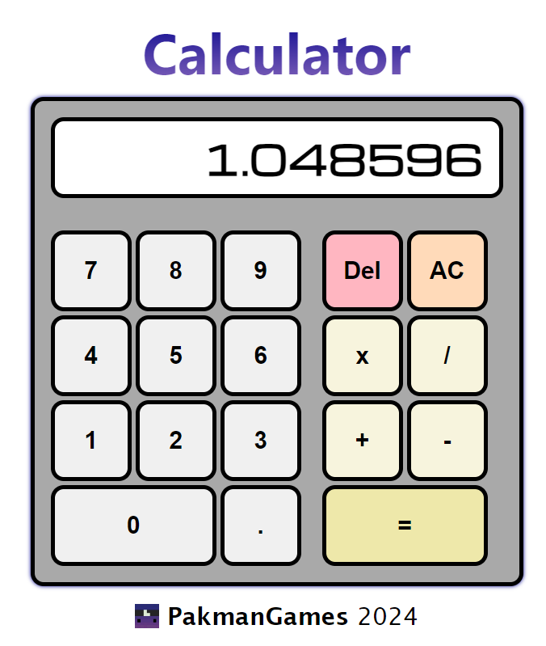
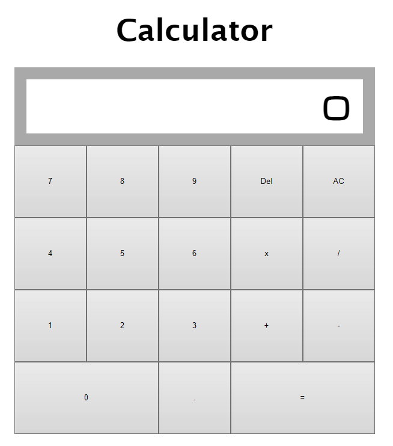
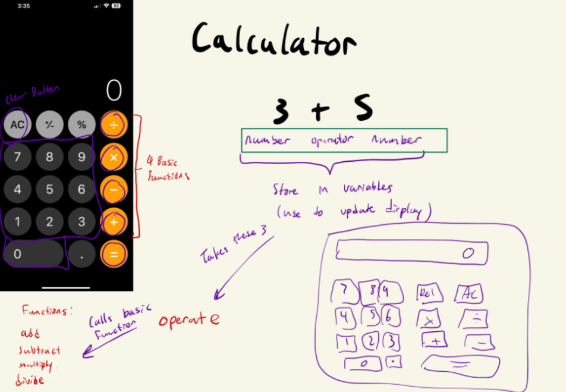

# Calculator In JavaScript  

This project uses many different concepts which include:
- Flexbox
- DOM manipulation
- Event listeners for mouse clicks and keyboard
- Objects and array methods

Through this project I have been able to put to practice my knowledge of event listeners in creating a dynamically updating calculator. As well as make the buttons visually change upon being pressed on and playing a sound effect to go along.  

Click [here](https://pakmangames.github.io/calculator) to try it out for yourself.  

Here's a preview of what it looks like:  

This is how it looked in earlier stages:  

And this is what the initial concept brainstorm looked like:  

This is the link of where I learned to give the title a [linear gradient](https://stackoverflow.com/questions/8384751/css-text-gradient) colour.